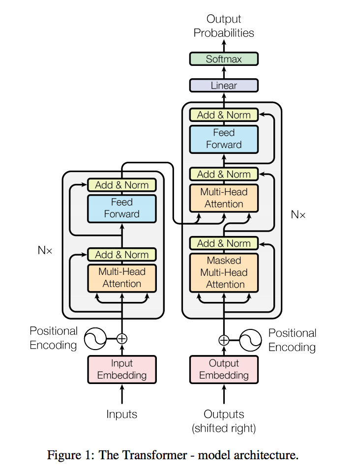

# Transcription Factor Transformer Imputation (TFTI)
* Alexander Ku\*, Gunjan Baid\*, J. Weston Hughes, Alyssa Morrow, Ashish Vaswani
* Corresponding email: `alexku@berkeley.edu`, `gunjan_baid@berkeley.edu`
* And anyone else who wants to get involved!

## Background

Understanding the interplay between transcription factors (TFs) and DNA is an important step in better understanding differential gene expression. TFs are proteins that bind to specific sequences in the genome to regulate the rate at which DNA is transcribed into RNA and thereby translated into proteins. Recent advancements in both sequencing technologies and wet-lab assays (e.g., ChIP-seq) can accurately identify TF binding sites. However, these methods are time and cost-intensive, and produce a massive amount of raw data, thus motivating the need for an efficient computational approach.
While previous works in Deep Learning have had considerable success with TF binding site prediction (DeepSEA, DeepBind, etc.), they have two limitations that we seek to address. First, they often aim to predict TF binding events indepentently. This is problematic, as it is well established that TFs interact to form large protein complexes. Second, when partial binding information is available, there is no obvious way to leverage it to improve the prediction.


### Problem Setting
Suppose we have N binding events to predict and we only know the ground truth for K of them. We aim to develop an algorithm that can leverage the K observed events to impute the remaining N-K.

## Architecture

The TFTI algorithm uses an augmented Transformer network architecture ([Vaswani *et al.*](http://papers.nips.cc/paper/7181-attention-is-all-you-need)) in a semi-generative manner. The key differences are the following:

1. The decoder input is a latent tensor with the same dimensionality as the prediction logits. This tensor will encode the K observed binding events and, through successive passes through the netwtork, will be transformed into our actual logits (presumably with the N-K unobserved binding events imputed). In the pure predictive setting, the latent code is a zero-tensor.
2. The decoder self-attention is no longer masked to be causal. We are interested in the mutual interaction between binding events.
3. No decoder positional embeddings.



Above is the model architecture diagram of the Transformer. 

## Instructions

```
pip install tensor2tensor

# See what problems, models, and hyperparameter sets are available.
# You can easily swap between them (and add new ones).
t2t-trainer --registry_help

PROBLEM=genomics_binding_deepsea
MODEL=tfti_transformer
HPARAMS_SET=tfti_transformer_debug
HPARAMS=''

USR_DIR=tfti
DATA_DIR=$HOME/t2t_data
TMP_DIR=/tmp/t2t_datagen
TRAIN_DIR=$HOME/t2t_train/$PROBLEM/$MODEL-$HPARAMS

mkdir -p $DATA_DIR $TMP_DIR $TRAIN_DIR

# Generate data
t2t-datagen \
  --t2t_usr_dir=$USR_DIR \
  --data_dir=$DATA_DIR \
  --tmp_dir=$TMP_DIR \
  --problem=$PROBLEM

# Train
# *  If you run out of memory, add --hparams='batch_size=1024'.
t2t-trainer \
  --t2t_usr_dir=$USR_DIR \
  --data_dir=$DATA_DIR \
  --problems=$PROBLEM \
  --model=$MODEL \
  --hparams_set=$HPARAMS_SET \
  --hparams=$HPARAMS \
  --output_dir=$TRAIN_DIR
```
